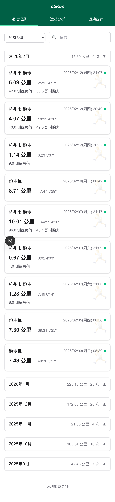
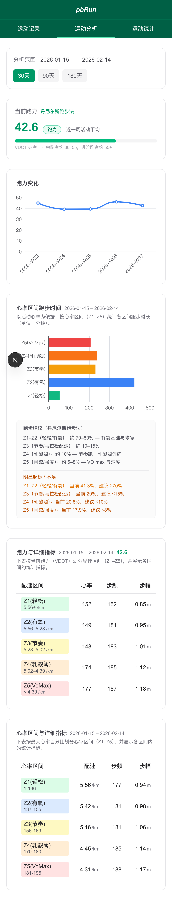
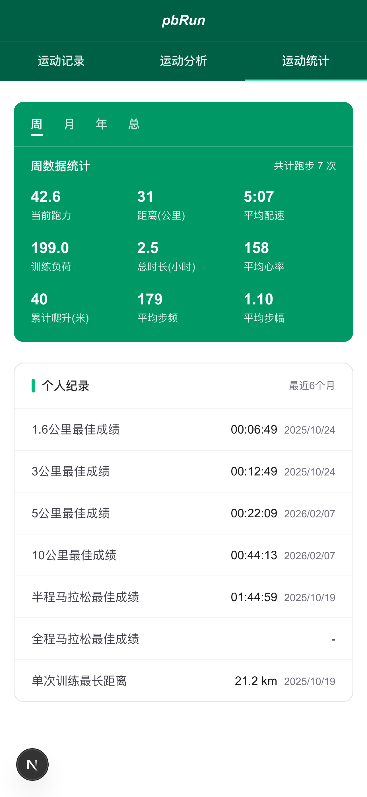

# 🏃 Garmin Running Data Analytics

**专业的跑步数据分析工具，助力跑者实现 PB**

基于 Garmin 数据，通过专业的跑力（VDOT）分析、心率区间分布、配速趋势等多维度数据，为跑者提供科学的训练建议和数据洞察。

<div align="center">

[](LICENSE)
[](https://nextjs.org/)
[](https://vercel.com)

[在线演示](https://pbrun.vercel.app) · [快速开始](#快速开始) · [文档](docs/README.md)

</div>

---

## 功能展示

> 💡 访问 [在线演示](https://pbrun.vercel.app) 体验完整功能
>
> 📱 完美适配移动端，支持手机、平板访问

<div align="center">

### 📊 活动列表 - 一目了然的跑步记录



*展示所有跑步记录，支持按月份筛选，清晰展示配速、距离、心率、跑力等关键指标*

---

### 📈 数据分析 - 专业的训练洞察



*完整的数据分析页面，包含：*
- *VDOT 跑力趋势图 - 追踪训练效果*
- *心率区间分布 - 优化训练强度（Z1-Z5）*
- *训练配速建议 - 基于 Jack Daniels 理论的科学配速*

---

### 📉 统计数据 - 全面的数据洞察



*全面的跑步统计，包括当前跑力、总里程、平均配速、个人记录等，数据一目了然*

---

### 🎯 训练配速 - 科学的训练指导


*基于当前 VDOT 计算各训练区间配速，提供心率和配速双重指导，助力科学训练*

</div>

---

## 为什么选择这个项目？

### 💡 核心价值

- **专业的跑力分析**：基于 Jack Daniels 的 VDOT 理论，精确计算跑力值，追踪训练效果
- **心率区间优化**：分析每次训练的心率分布，帮助优化有氧/无氧训练配比
- **配速趋势洞察**：可视化配速变化，识别疲劳点和进步曲线
- **个人记录追踪**：自动识别和记录不同距离的 PB（个人最佳成绩）

### ✨ 技术优势

- **完全免费** 🎉 - 无需购买云数据库，零运营成本
- **一键部署** 🚀 - 部署到 Vercel，享受全球 CDN 加速
- **数据离线化** 💾 - SQLite 数据库随代码版本管理，数据永不丢失
- **自动同步** 🔄 - GitHub Actions 每日自动同步，无需手动操作
- **隐私安全** 🔒 - 数据存储在自己的 GitHub 仓库，完全掌控
- **移动端优化** 📱 - 完美适配手机端，随时随地查看数据

## 技术方案

```

步骤 1: 数据同步（每日自动）
┌─────────────────┐
│  Garmin 国际区   │
│   运动数据       │  FIT 文件
│                 │────────┐
└─────────────────┘        │
                           ▼
                    ┌───────────────┐
                    │ GitHub Actions│
                    │ ・下载 FIT     │
                    │ ・解析数据     │
                    │ ・计算 VDOT    │
                    └──────┬────────┘
                           │
步骤 2: 数据存储             │ 写入并提交
┌─────────────────┐        │
│   GitHub 仓库    │        │
│                 │◄───────┘
│ ・代码文件        │
│ ・SQLite 数据库   │
└────────┬────────┘
         │
         │ 自动部署
         ▼
步骤 3: 应用部署
┌─────────────────┐
│     Vercel      │
│  ・Next.js 应用  │
│  ・API Routes   │
│  ・SQLite 读取   │
└────────┬────────┘
         │
         │ HTTPS
         ▼
步骤 4: 用户访问
┌─────────────────┐
│   用户浏览器     │
│  ・查看数据      │
│  ・分析图表      │
└─────────────────┘

━━━━━━━━━━━━━━━━━━━━━━━━━━━━━━━━━━━━━━━━━━━━━━━━━
核心优势

✓ 完全免费    数据库文件随代码提交，无需购买云数据库
✓ 数据安全    SQLite 文件存在自己的 GitHub 仓库
✓ 自动同步    GitHub Actions 每日自动运行
✓ 全球加速    Vercel CDN 全球节点，响应 <100ms
✓ 版本管理    数据库支持 Git 版本控制，永不丢失
━━━━━━━━━━━━━━━━━━━━━━━━━━━━━━━━━━━━━━━━━━━━━━━━━
```

### 技术栈

- **数据同步**: Node.js + Garmin Connect API
- **数据解析**: FIT SDK (心率、配速、GPS 等 28+ 字段)
- **数据存储**: SQLite (离线数据库，随代码部署)
- **Web 框架**: Next.js 16 (App Router + API Routes)
- **数据可视化**: ECharts (跑力趋势、心率区间、配速分析)
- **自动化**: GitHub Actions (每日同步 + 自动部署)
- **部署平台**: Vercel (零配置，全球 CDN)

## 快速开始

### 前置要求

- Node.js 18+
- Garmin 国际区账号 (国区不支持)
- GitHub 账号
- Vercel 账号 (可选，用于部署)

### 1. 克隆仓库

```bash
git clone https://github.com/your-username/garmin_data.git
cd garmin_data
npm install
```

> **macOS 用户**：若 `npm install` 时 better-sqlite3 编译报错（如 `climits file not found`），请先设置 SDK 路径再安装：
> ```bash
> SDKROOT=$(xcrun --sdk macosx --show-sdk-path) npm install
> ```

### 2. 配置 Garmin 认证

```bash
# 获取 Garmin 认证 Token
node scripts/get-garmin-token.js

# 按提示输入用户名和密码，会自动生成 GARMIN_SECRET_STRING
```

### 3. 配置环境变量

创建 `.env` 文件:

```bash
# Garmin 认证 (从上一步获取)
GARMIN_SECRET_STRING="your_token_here"

# 个人心率参数 (用于计算心率区间和 VDOT)
MAX_HR=190        # 最大心率
RESTING_HR=55     # 静息心率
```

### 4. 初始化数据

```bash
# 一键同步所有历史数据
npm run init:data

# 或者手动测试同步最近 5 条记录
node scripts/sync-garmin.js --limit 5
```

### 5. 启动开发服务器

```bash
npm run dev
# 访问 http://localhost:3000
```

## 部署到 Vercel

详细部署指南请参考 [部署文档](docs/deployment.md)

### 快速部署步骤

1. **Fork 本仓库** 到你的 GitHub 账号

2. **配置 GitHub Secrets**
   - 进入仓库 Settings > Secrets > Actions
   - 添加以下 Secrets:
     - `GARMIN_SECRET_STRING`
     - `MAX_HR`
     - `RESTING_HR`

3. **连接 Vercel**
   - 登录 [Vercel](https://vercel.com)
   - 导入你 Fork 的仓库
   - 自动检测 Next.js 项目，一键部署

4. **启动自动同步**
   - GitHub Actions 会每日自动运行
   - 同步数据后自动提交到仓库
   - Vercel 检测到数据库更新后自动重新部署

## 功能特性

- ✅ **活动列表** - 查看所有跑步记录，支持按月份筛选
- ✅ **活动详情** - 详细的配速、心率、海拔数据和分段信息
- ✅ **统计分析** - 月度/年度里程、跑量、个人记录
- ✅ **跑力分析** - VDOT 趋势图，追踪训练效果
- ✅ **心率区间** - 分析有氧/无氧训练占比
- ✅ **配速分布** - 识别舒适配速区间
- ✅ **训练建议** - 基于 Daniels 训练法的配速建议

## 项目结构

```
garmin_data/
├── app/                    # Next.js 应用
│   ├── api/               # API 路由 (RESTful)
│   ├── list/              # 活动列表页面
│   ├── analysis/          # 数据分析页面
│   ├── stats/             # 统计页面
│   └── lib/               # 工具库 (数据库、格式化)
├── scripts/               # 数据同步脚本
│   ├── sync-garmin.js     # 主同步脚本
│   ├── fit-parser.js      # FIT 文件解析
│   ├── vdot-calculator.js # VDOT 跑力计算
│   └── db-manager.js      # 数据库操作
├── .github/workflows/     # GitHub Actions
│   └── sync_garmin_data.yml
├── app/data/              # SQLite 数据库
│   └── activities.db
└── docs/                  # 文档
    ├── deployment.md      # 部署指南
    ├── data-sync.md       # 数据同步说明
    └── api-reference.md   # API 接口文档
```

## API 接口

| 端点 | 说明 | 参数 |
|------|------|------|
| `GET /api/activities` | 获取活动列表 | `month`, `limit`, `offset` |
| `GET /api/activities/[id]` | 获取活动详情 | - |
| `GET /api/activities/[id]/laps` | 获取分段数据 | - |
| `GET /api/stats` | 获取统计数据 | `year`, `month` |
| `GET /api/vdot` | 获取 VDOT 趋势 | `days` |
| `GET /api/analysis/hr-zones` | 心率区间分析 | `month` |
| `GET /api/analysis/pace-zones` | 配速分布分析 | `month` |

完整 API 文档: [docs/api-reference.md](docs/api-reference.md)

## 文档

- [部署指南](docs/deployment.md) - Vercel 部署和 GitHub Actions 配置
- [数据同步说明](docs/data-sync.md) - Garmin 数据同步原理和配置
- [API 参考](docs/api-reference.md) - 完整的 API 接口文档
- [VDOT 计算说明](docs/vdot-calculation.md) - 跑力计算公式和原理
- [常见问题](docs/faq.md) - 常见问题解答

## 贡献

欢迎提交 Issue 和 Pull Request！

### 开发指南

```bash
# 克隆仓库
git clone https://github.com/your-username/garmin_data.git
cd garmin_data

# 安装依赖（macOS 若遇 better-sqlite3 编译错误，改用：SDKROOT=$(xcrun --sdk macosx --show-sdk-path) npm install）
npm install

# 启动开发服务器
npm run dev

# 运行数据验证
node scripts/validate-data.js
```

## 开源协议

[MIT License](LICENSE)

---

## Star History

如果这个项目对你有帮助，请给一个 ⭐️ Star！

## 致谢

- [Jack Daniels' Running Formula](https://www.amazon.com/Daniels-Running-Formula-Jack-Tupper/dp/1450431836) - VDOT 理论基础
- [Garmin Connect](https://connect.garmin.com/) - 数据来源
- [Next.js](https://nextjs.org/) - Web 框架
- [Vercel](https://vercel.com/) - 部署平台
